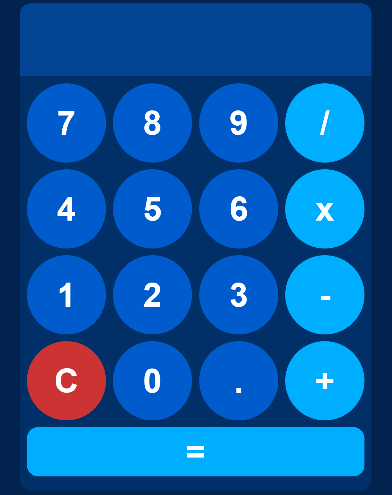

# 💡 Responsive Calculator App

A sleek, responsive calculator built using **HTML**, **CSS**, and **JavaScript**. Designed to adapt smoothly to all screen sizes with a clean UI, circular buttons, and dynamic grid layout. The app handles basic arithmetic operations and includes a wide `=` button for a polished touch.

---

## 📸 Preview



---

## 🚀 Features

- Responsive layout for mobile and desktop
- Circular buttons with hover effects
- Basic arithmetic operations: `+`, `-`, `*`, `/`
- Clear (`C`) and decimal (`.`) support
- Full-width equals (`=`) button for modern styling
- Prevents overflow and clipping on all screen sizes

---

## 🧱 Built With

- HTML5
- CSS3 (Flexbox + Grid + Clamp + Aspect-Ratio)
- JavaScript (vanilla)

---

## 🔧 How to Run

1. Clone the repo or download the files:
   ```bash
   git clone https://github.com/glennnoronha/calculator-javascript.git

